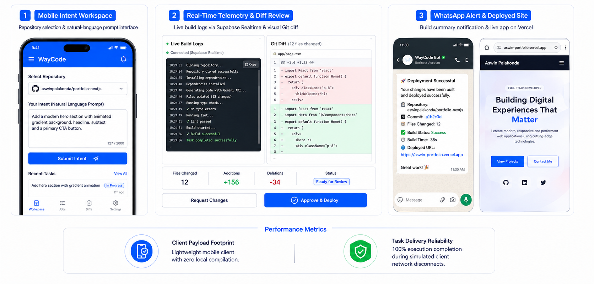
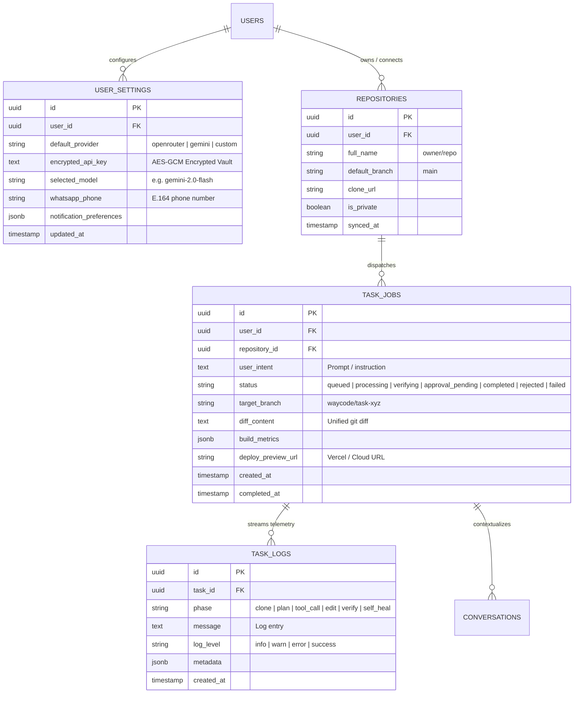
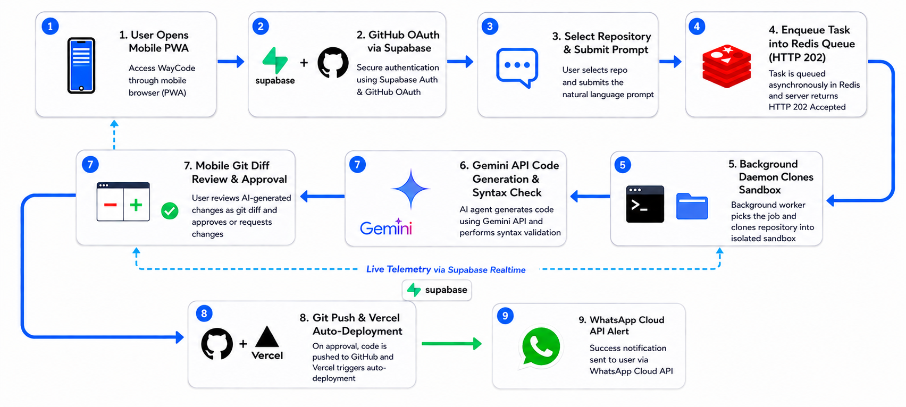

<div align="center">

  

  # 🚀 WayCode
  ### Asynchronous, Intent-Driven Mobile Gateway for Autonomous Software Engineering Agents

  [](https://nextjs.org/)
  [](https://www.typescriptlang.org/)
  [](https://tailwindcss.com/)
  [](https://supabase.com/)
  [](https://redis.io/)
  [](https://www.docker.com/)

  *Dispatch software engineering tasks from your phone in natural language. Executed by a persistent cloud daemon on your VPS. Reviewed and approved on mobile before pushing to production.*

  ---

</div>

## 📌 Executive Summary

**WayCode** reframes the relationship between a mobile device and a software repository: the phone becomes a **remote control for an autonomous engineering daemon**, not a terminal emulator. 

The developer expresses **intent** (*"Add a Supabase auth hook to the checkout page"*); WayCode's cloud agent handles **execution** (cloning, branching, editing, building, verifying); and the mobile UI makes execution legible, interruptible, and safely reviewable anywhere.

---

## ✨ Core Features & Guarantees

| Feature / Guarantee | Badge | Description |
| :--- | :---: | :--- |
| **Zero Local Compute** | ⚡ | The mobile client performs zero compilation, linting, or build execution — 100% offloaded to VPS. |
| **Asynchronous Task Queue** | 🔄 | Instant `HTTP 202 Accepted` response on intent submission; task execution is fully decoupled from client connection state. |
| **Bring Your Own Key (BYOK)** | 🔑 | Choose between **OpenRouter**, **Gemini API**, or **Custom OpenAI-Compatible** endpoints with in-app encrypted vault. |
| **Zero-Cost Model Support** | 🆓 | Native support for zero-cost models (`gemini-2.0-flash-exp:free`, `llama-3.3-70b-instruct:free`, `deepseek-r1:free`, `qwen-2.5-coder-32b:free`). |
| **Interactive Connection Tester** | 🧪 | Kiro-style validation ping checking API keys and models before saving (`Connected` vs `Invalid Key`). |
| **Self-Healing Agent Loop** | 🩹 | Bounded compiler error feedback loop (`npx tsc --noEmit`) automatically correcting syntax errors before final review. |
| **Mobile Git Diff Reviewer** | 🔍 | Mobile-optimized side-by-side / unified diff viewer with line additions (`#10B981`) & deletions (`#EF4444`). |
| **Supabase Realtime Telemetry** | 📡 | Live append-only execution log streamer via Postgres Change Data Capture (CDC). |
| **Out-of-Band Alerts** | 📱 | WhatsApp Business Cloud API notification containing live Vercel deployment preview links. |

---

## 🛠️ Architecture & System Topology

<div align="center">
  
</div>

---

## 📊 Database Schema & Data Models (Supabase BaaS)

WayCode leverages **Supabase PostgreSQL** with **Row-Level Security (RLS)** and **Realtime Change Data Capture (CDC)** to maintain high-throughput state isolation across multiple tenants and mobile clients.



### Table Breakdown

| Table | Purpose | Security & RLS Policy |
| :--- | :--- | :--- |
| **`user_settings`** | Stores encrypted BYOK keys, default model selections, and notification settings. | `auth.uid() = user_id` (Strict Owner Isolation) |
| **`repositories`** | Syncs user GitHub repositories, webhooks, and default branch configurations. | `auth.uid() = user_id` |
| **`task_jobs`** | State machine for active engineering tasks, diffs, build outputs, and approval gates. | `auth.uid() = user_id` |
| **`task_logs`** | High-frequency telemetry log stream ingested via Supabase Realtime CDC. | `auth.uid() = (SELECT user_id FROM task_jobs WHERE id = task_logs.task_id)` |
| **`conversations`** | Contextual multi-turn chat memory and session snapshots. | `auth.uid() = user_id` |

---

## ⚙️ How It Works: The 9-Stage Autonomous Lifecycle

WayCode completely decouples the mobile client from the execution runtime through a persistent, 9-stage asynchronous pipeline:

<div align="center">
  
</div>

---

## 🌟 SaaS Features & Highlights

### 🔑 Bring Your Own Key (BYOK) Engine
- **Multi-Provider Hub**: Toggle between **OpenRouter**, **Google Gemini direct**, **Anthropic Claude**, and custom **OpenAI-compatible** endpoints.
- **Zero-Cost Presets**: Built-in support for free tier models (`gemini-2.0-flash-exp:free`, `deepseek-r1:free`, `llama-3.3-70b-instruct:free`, `qwen-2.5-coder-32b:free`).
- **Interactive Connection Tester**: Kiro-style validation ping checking credentials, latency, and model availability before saving.
- **AES-GCM Key Vault**: Keys are encrypted at rest using modern cryptographic primitives.

### 📱 Mobile-First Autonomous Control Plane
- **PWA Ready**: Installable on iOS (Safari Add to Home Screen) and Android (Chrome Web APK).
- **Interactive Unified Diff Viewer**: Syntax highlighted, pinch-to-zoom, file tree navigator, and jump-to-line selector.
- **Connection-Independent Resilience**: Close your laptop, step on a flight, or lose cellular service — task jobs persist in Redis and resume telemetry streaming on reconnect.

### 📡 Realtime Observability & Telemetry
- **6-Phase Log Streamer**: Realtime categorization (`clone` → `plan` → `tool_call` → `edit` → `verify` → `deploy`).
- **Terminal Simulation**: Filter logs by level (`info`, `warn`, `error`, `success`) with timestamp precision.

---

## 🚀 Self-Hosting & Quickstart

### Prerequisites
- **Node.js**: `20.x` or higher
- **Package Manager**: `npm`, `pnpm`, or `bun`
- **Docker**: For running Redis & Sandboxed containers
- **Supabase Account**: Free or Pro tier project

### 1. Clone & Install Dependencies
```bash
git clone https://github.com/Aswinsaipalakonda/WayCode.git
cd WayCode
npm install
```

### 2. Configure Environment Variables
Create `.env.local` in the project root:

```env
# Supabase Configuration
NEXT_PUBLIC_SUPABASE_URL=https://your-project.supabase.co
NEXT_PUBLIC_SUPABASE_ANON_KEY=your-supabase-anon-key
SUPABASE_SERVICE_ROLE_KEY=your-supabase-service-role-key

# Redis Queue Connection
REDIS_URL=redis://127.0.0.1:6379

# Encryption Secret for BYOK Vault (32-char hex string)
ENCRYPTION_SECRET=your_32_character_encryption_secret_key

# Optional: Meta WhatsApp Cloud API (Out-of-band alerts)
WHATSAPP_API_TOKEN=your_meta_whatsapp_api_token
WHATSAPP_PHONE_NUMBER_ID=your_whatsapp_phone_number_id

# Optional: GitHub OAuth & Vercel
GITHUB_CLIENT_ID=your_github_oauth_client_id
GITHUB_CLIENT_SECRET=your_github_oauth_client_secret
VERCEL_DEPLOY_HOOK_URL=your_vercel_deploy_hook_url
```

### 3. Start Local Redis via Docker
```bash
docker run -d --name waycode-redis -p 6379:6379 redis:alpine
```

### 4. Run Database Schema Setup
Run the SQL migration in your Supabase SQL Editor or via Supabase CLI:
```bash
supabase db push
```

### 5. Launch the Development Server
```bash
npm run dev
```
Open [http://localhost:3000](http://localhost:3000) on your browser or mobile network.

---

## 🧪 Testing & Quality Assurance

WayCode maintains strict quality gates across unit tests, type safety, and production build pipelines:

```bash
# Run Vitest unit & integration test suites
npm test

# Run TypeScript compilation check
npx tsc --noEmit

# Run Next.js production build bundle validation
npm run build
```

---

## 🔒 Security & Privacy Architecture

- **Zero Data Exposure**: Code diffs and prompts are transmitted only between your mobile client, your private VPS worker daemon, and your chosen LLM endpoint.
- **Ephemeral Sandbox Directories**: All git repositories are checked out into temporary filesystem workspaces with isolated file permissions.
- **Row-Level Security (RLS)**: Enforces strict tenant separation at the database engine level; unauthorized cross-user queries are rejected by Postgres.
- **Encrypted Secrets**: Sensitive API keys and tokens are encrypted with `AES-256-GCM` using customer-managed cryptographic seeds.

---

## 🗺️ Roadmap & Milestones

- [x] **v1.0**: Core Next.js 16 App Router interface, GitHub OAuth, and mobile landing page.
- [x] **v2.0**: Redis persistent task queue, Supabase Realtime CDC telemetry, and BYOK settings vault.
- [x] **v2.4**: Self-healing TypeScript compiler feedback loop (`npx tsc --noEmit`) and Meta WhatsApp notifications.
- [ ] **v3.0**: Multi-agent collaborative swarms (Planner + Coder + Reviewer).
- [ ] **v3.2**: Voice-driven mobile intent capture and offline audio transcription.
- [ ] **v3.5**: Native iOS & Android companion apps via Expo / Capacitor.

---

## 🤝 Contributing to WayCode

We welcome contributions from the open-source community!

1. **Fork the Repository**: Click `Fork` on GitHub.
2. **Create a Feature Branch**: `git checkout -b feature/amazing-feature`
3. **Commit Your Changes**: Follow [Conventional Commits](https://www.conventionalcommits.org/) (`feat: add new LLM provider adapter`).
4. **Verify Quality**: Run `npm test` and `npx tsc --noEmit` before pushing.
5. **Open a Pull Request**: Submit a PR to `main` with a clear summary of your changes.

---

## 📄 License & Attribution

WayCode is open-source software licensed under the [MIT License](LICENSE).

<div align="center">
  <sub>Built with ❤️ by <a href="https://github.com/Aswinsaipalakonda">Aswin Sai Palakonda</a> and the open-source community.</sub>
</div>
