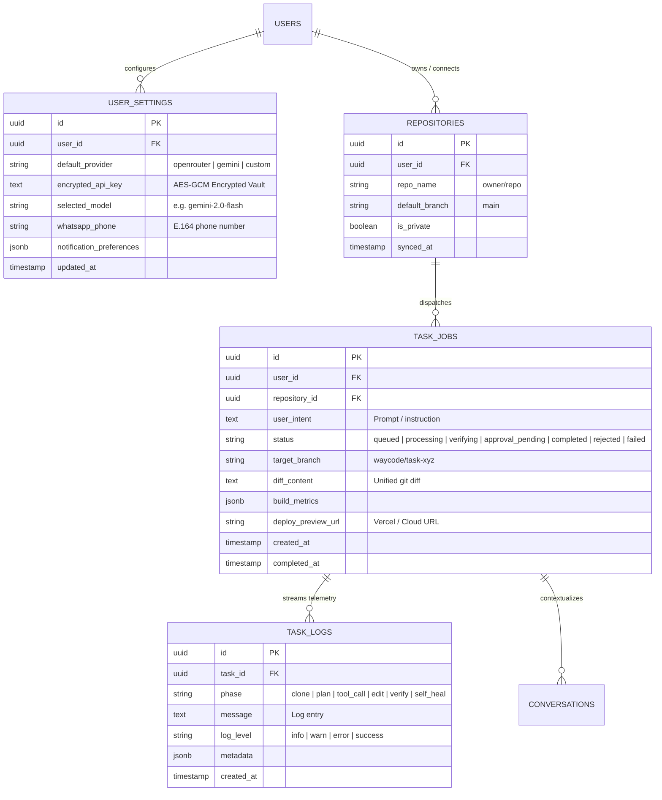

<div align="center">

  

  # 🚀 WayCode
  ### Asynchronous, Intent-Driven Mobile Gateway for Autonomous Software Engineering Agents

  [](https://waycode.aswinsai.tech)
  [](https://nextjs.org/)
  [](https://www.typescriptlang.org/)
  [](https://tailwindcss.com/)
  [](https://supabase.com/)
  [](https://redis.io/)
  [](https://www.docker.com/)

  *Dispatch software engineering tasks from your phone in natural language. Executed by a persistent cloud daemon on your VPS. Reviewed and approved on mobile before pushing to production.*

  ---

</div>

## 📌 Executive Summary

**WayCode** reframes the relationship between a mobile device and a software repository: the phone becomes a **remote control for an autonomous engineering daemon**, not a terminal emulator.

The developer expresses **intent** (*"Add a Supabase auth hook to the checkout page"*); WayCode's cloud agent handles **execution** (cloning, branching, editing, building, verifying); and the mobile UI makes execution legible, interruptible, and safely reviewable anywhere.

---

## ✨ Core Features & Guarantees

| Feature / Guarantee | Badge | Description |
| :--- | :---: | :--- |
| **Zero Local Compute** | ⚡ | The mobile client performs zero compilation, linting, or build execution — 100% offloaded to VPS. |
| **Asynchronous Task Queue** | 🔄 | Instant `HTTP 202 Accepted` response on intent submission; task execution is fully decoupled from client connection state. |
| **Bring Your Own Key (BYOK)** | 🔑 | Choose between **OpenRouter**, **Gemini API**, or **Custom OpenAI-Compatible** endpoints with in-app encrypted vault. |
| **Zero-Cost Model Support** | 🆓 | Native support for zero-cost models (`gemini-2.0-flash-exp:free`, `llama-3.3-70b-instruct:free`, `deepseek-r1:free`, `qwen-2.5-coder-32b:free`). |
| **Interactive Connection Tester** | 🧪 | Validation ping checking API keys and models before saving (`Connected` vs `Invalid Key`). |
| **Self-Healing Agent Loop** | 🩹 | Bounded compiler error feedback loop (`npx tsc --noEmit`) automatically correcting syntax errors before final review. |
| **Mobile Git Diff Reviewer** | 🔍 | Mobile-optimized side-by-side / unified diff viewer with line additions & deletions. |
| **Supabase Realtime Telemetry** | 📡 | Live append-only execution log streamer via Postgres Change Data Capture (CDC). |
| **Out-of-Band Alerts** | 📱 | WhatsApp Business Cloud API notifications for task updates & deploy links. |

---

## 🛠️ Architecture & System Topology

<div align="center">
  
</div>

---

## 📊 Database Schema & Data Models (Supabase BaaS)

WayCode leverages **Supabase PostgreSQL** with **Row-Level Security (RLS)** and **Realtime Change Data Capture (CDC)** to maintain high-throughput state isolation across multiple tenants and mobile clients.



### Table Breakdown

| Table | Purpose | Security & RLS Policy |
| :--- | :--- | :--- |
| **`user_settings`** | Stores encrypted BYOK keys, default model selections, and notification settings. | `auth.uid() = user_id` (Strict Owner Isolation) |
| **`repositories`** | Syncs user GitHub repositories, webhooks, and privacy flags (`is_private`). | `auth.uid() = user_id` |
| **`task_jobs`** | State machine for active engineering tasks, diffs, build outputs, and approval gates. | `auth.uid() = user_id` |
| **`task_logs`** | High-frequency telemetry log stream ingested via Supabase Realtime CDC. | `auth.uid() = (SELECT user_id FROM task_jobs WHERE id = task_logs.task_id)` |
| **`conversations`** | Contextual multi-turn chat memory and session snapshots. | `auth.uid() = user_id` |

---

## ⚙️ The 9-Stage Autonomous Lifecycle

<div align="center">
  
</div>

1. **Intent Submission**: User speaks or types a change intent from mobile.
2. **Authentication & Authorization**: GitHub OAuth token resolution via encrypted vault.
3. **Queue Enqueue**: Immediate `HTTP 202 Accepted` and job payload dispatched to Redis.
4. **Agent Orchestration**: Worker daemon runs multi-stage planning, diffing, and code modification.
5. **Sandboxed Execution**: Isolated filesystem checkout and local dependency execution.
6. **Self-Healing Verification**: Automated `tsc --noEmit` and unit testing feedback loop.
7. **Branch & Pull Request**: Verified branch created and pushed to GitHub with clean commit history.
8. **Preview Deployment**: Deployment triggers (e.g. Vercel) and URL capture.
9. **Notification & Mobile Review**: Mobile push and WhatsApp alerts with live diff approval button.

---

## 🚀 Getting Started & Local Development

### Prerequisites
- **Node.js**: `20.x` or `22.x`
- **Docker**: For running Redis
- **Supabase Account**: Free or Pro tier project

### 1. Clone & Install Dependencies
```bash
git clone https://github.com/Aswinsaipalakonda/WayCode.git
cd WayCode
npm install
```

### 2. Configure Environment Variables
Create `.env.local` in the project root:

```env
# Supabase Configuration
NEXT_PUBLIC_SUPABASE_URL=https://your-project.supabase.co
NEXT_PUBLIC_SUPABASE_ANON_KEY=your-supabase-anon-key
SUPABASE_SERVICE_ROLE_KEY=your-supabase-service-role-key

# Redis Queue Connection
REDIS_URL=redis://127.0.0.1:6379

# Encryption Key for BYOK Vault (openssl rand -hex 32)
SETTINGS_ENCRYPTION_KEY=your_64_character_hex_encryption_key

# Optional: Meta WhatsApp Cloud API
WHATSAPP_TOKEN=your_whatsapp_token
WHATSAPP_PHONE_NUMBER_ID=your_phone_number_id

# Optional: Production App URL
NEXT_PUBLIC_APP_URL=http://localhost:3000
```

### 3. Start Local Redis
```bash
docker run -d --name waycode-redis -p 6379:6379 redis:alpine
```

### 4. Run Development Server & Worker Daemon
```bash
# Terminal 1: Web Interface
npm run dev

# Terminal 2: Background Task Worker Daemon
npm run worker
```
Open [http://localhost:3000](http://localhost:3000) on your browser.

---

## 🧪 Testing & Quality Assurance

```bash
# Run Vitest unit & integration test suites
npm test

# Run Next.js production build bundle validation
npm run build
```

---

## 🔒 Security & Privacy

- **Zero Data Exposure**: Code diffs and prompts are transmitted only between your mobile client, your private worker daemon, and your chosen LLM endpoint.
- **Ephemeral Workspaces**: All git repositories are processed in temporary filesystem sandboxes.
- **Row-Level Security (RLS)**: Enforces strict tenant separation at the PostgreSQL database engine level.
- **AES-256-GCM Encryption**: BYOK API keys and GitHub tokens are encrypted at rest with authenticated encryption.

---

## 📄 License & Attribution

WayCode is open-source software licensed under the [MIT License](LICENSE).

<div align="center">
  <sub>Built with ❤️ by <a href="https://github.com/Aswinsaipalakonda">Aswin Sai Palakonda</a> and the open-source community.</sub>
</div>
